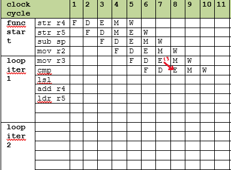

# Homework 5

Due Monday May 1 by the start of class at 9:20AM. This is a written 
assignment. Turn it in neat and stapled.  

## Instruction Set Details

1. Convert, by hand, the assembly instruction `addsge r1, sp, #254` to its
32 bit ARM instruction encoding.  Be clear and neat, and explain every 
portion of the 32 bit encoding.  Check your work with `objdump` but do not
use that to determine the encoding. You will not be able to use `objdump` 
on the final exam. 

2. What assembly instruction corresponds to the encoding `b0130594`.
Explain every portion of the instruction format and describe the process
you went through to decode the instruction beginning at the web page [Arm Instruction Set Encoding](https://developer.arm.com/documentation/ddi0406/c/Application-Level-Architecture/ARM-Instruction-Set-Encoding/ARM-instruction-set-encoding). Double check your work using `objdump`.

3. Consider the C function `f` below.
```
int f(int x) {
    if (x < 0)
        return x + 1;
    else
        return x - 1;
}

```
Write `f` in ARM assembly using conditional instruction execution
with no branching. Provide comments explaining the code. Do this by hand and verify your work using `-O3`. However, you will not be able to do this on the exam, so I suggest you do this by hand first. 

4. Consider the ARM instruction `str r0, [r1, #4]` and the [CPU datapath](https://diveintosystems.org/book/C5-Arch/_images/cpu.png) from *Dive Into Systems*.
 
    a. What are the values of **WE**, **Sw**, **Sr<sub>1</sub>**, and **Sr<sub>0</sub>**.

    b. What value is on the wite coming from the output of the ALU.

    c. What are the selector values for **MUX<sub>A</sub>**, **MUX<sub>B</sub>**, and the **MUX<sub>DataIn</sub>**. 	
 
5. Consider the C function `sum` below that sums up the items in an array.

```
int sum(int vec[], int n) {
    int sum = 0;
    int i = 0;

    while (i < n)
        sum = sum + vec[i++];

    return sum;
}
```

Here is an assembly language version.
```
sum:
	str r4, [sp,#-4]
	str r5, [sp,#-8]
	sub sp, sp, #8
	mov r2, #0   // sum = 0
	mov r3, #0   // i = 0

while:
	cmp r3, r1      // while i < n
	bge endwhile
	lsl r4, r3, #2  // 4 * i
	add r4, r0, r4  // vec + 4i
	ldr r5, [r4]    // r4 = vec[i]
	add r2, r2, r5  // sum = sum + r4
	add r3, r3, #1  // i = i + 1
	b while

endwhile:
	mov r0, r2
	ldr r5, [sp, #8]
	ldr r4, [sp, #4]
	add sp, sp, #8
	bx lr
``` 

a. What are the first three instructions of `sum` doing? How did we normally write that during the semester?

b. What are the last three instructions of `sum` doing? How did we normally write that during the semester?

c. In the course repo there is a Word docuemtn [`pipeline.docx`](pipline.docx).  Assuming the array being summed is of length two, complete filling in the pipleine stages until the function is complete.  Assume the pipeline can do ALU-ALU, MEM-ALU, and ALU-MEM 
forwarding, mark each forwarding path required. Mark any stalls required using an `X` in the dodument.  I started the table for you. 



	
