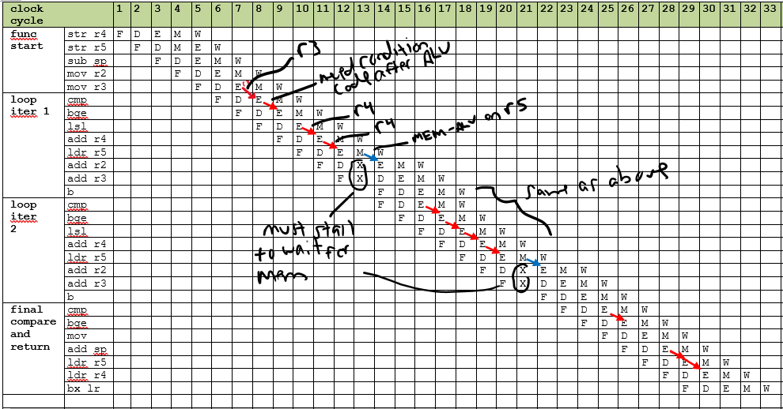

# Homework 6 (10 points)

Due Monday May 1 by the start of class at 9:20AM. This is a written 
assignment. Turn in a very neat writeup of these problems with all pages stapled. 

## Instruction Set Details

1. Convert, by hand, the assembly instruction `addsge r1, sp, #254` to its
32 bit ARM instruction encoding.  Be clear and neat, and explain every 
portion of the 32 bit encoding.  Check your work with `objdump` but do not
use that to determine the encoding. You will not be able to use `objdump` 
on the final exam. In order to get this instruction to compile use 
the assembler directive
```
.syntax unified
```

**Solution**

This is a data processing instruction. The condition is GE which is `1010`. 
The S bit is also set.  The destination is `r1` which is `0001`. The first source register is the stack-pointer which is register `r13`, or `1101`. The immediate value is 254, which, in twelve bits is `000011111110`.

Based on the encoding for add immediate instructions the bits are 
 
```
1010 0010 1001 1101 0001 0000 1111 1110
A    2    9    D    1    0    F    E
```

2. What assembly instruction corresponds to the encoding `b0130594`.
Explain every portion of the instruction format and describe the process
you went through to decode the instruction beginning at the web page [Arm Instruction Set Encoding](https://developer.arm.com/documentation/ddi0406/c/Application-Level-Architecture/ARM-Instruction-Set-Encoding/ARM-instruction-set-encoding). Double check your work using `objdump`.

**Solution**

Writing out the bits we have 

```
1011 0000 0001 0011 0000 0101 1001 0100
```

    a. The 4-bit condition code is `b`, or `1011`, which is `lt`. 
	b. Looking at the next two bits, which are `00`, which is a data processing instruction.
	c. The `op` bit is a `0`, and `op1` is `00001` and `op2` is `1001`. This is a 
	multiply.
	d. The `S` is 1. 
	e. The destination register `Rd` is 3. The second source register `Rm` is 5
    f. The first source register `Rn` is 4.	
	
Using this we can see that we have a `mulslt r3, r4, r5`.   

3. Consider the C function `f` below.
```
int f(int x) {
    if (x < 0)
        return x + 1;
    else
        return x - 1;
}

```
Write `f` in ARM assembly using conditional instruction execution
with no branching. Provide comments explaining the code. Do this by hand and verify your work using `-O3`. However, you will not be able to use `-O3` on the exam, so do this by hand first. 

**Solution**

```
f:
	tst r0, 0          // test to see if x is 0
	addlt r0, r0, #1   // if it is, then add 1
	subge r0, r0, #1   // otherwise subtract 1
	bx lr
```

4. Consider the ARM instruction `str r0, [r1, #4]` and the [CPU datapath](https://diveintosystems.org/book/C5-Arch/_images/cpu.png) from *Dive Into Systems*.
 
    a. What are the values of **WE**, **Sw**, **Sr<sub>1</sub>**, and **Sr<sub>0</sub>**.
	
	**Solution**: WE = 0 (because a register is not written) 
	Sw = *don't care* (a register is not being written). 
	Sr<sub>0</sub> = 1 (register 1), Sr<sub>1</sub> is a don't care because
	there is only one source register.

    b. What value is on the wire(s) coming from the output of the ALU.
	
	**Solution:** `r1 + 4`

    c. What are the selector values for **MUX<sub>A</sub>**, **MUX<sub>B</sub>**, and the **MUX<sub>DataIn</sub>** 	
	
	**Solution:**  Selector for **MUX<sub>A</sub>** is 1 because we need the 
    value of `r1`.	Selector for **MUX<sub>B</sub>** is 0 because we need the 
    immediate value of `4` coming directly out of the instruction. Selector
	for **MUX<sub>DataIn</sub>** is *don't care* because **WE** is `0`.
	
    d. In terms of the five stages of instruction execution, explain what happens at each stage. 
	
	**Solution**
        1. **Fetch** The instruction is fetched out of memory at address `PC`.
        2. **Decode** The instruction is decoded with register and imediate values now available to the ALU. 
        3. **Execute** The ALU performans an operation on data from decode.
        4. **Memory** Load (`ldr`) and store (`str`) instructions access memory.
		All other instructions do nothing during this phase.
        5. **Writeback** Instructions that have a destination register, write the value back to the register file. Most instructions have a destination. There are a few that do not, `str`, `cmp`, `b<cond>`, `tst`. 
 
5. Consider the C function `sum` below that sums up the items in an array.

```
int sum(int vec[], int n) {
    int sum = 0;
    int i = 0;

    while (i < n)
        sum = sum + vec[i++];

    return sum;
}
```

Here is an assembly language version.
```
sum:
	str r4, [sp,#-4]
	str r5, [sp,#-8]
	sub sp, sp, #8
	mov r2, #0   // sum = 0
	mov r3, #0   // i = 0

while:
	cmp r3, r1      // while i < n
	bge endwhile
	lsl r4, r3, #2  // 4 * i
	add r4, r0, r4  // vec + 4i
	ldr r5, [r4]    // r4 = vec[i]
	add r2, r2, r5  // sum = sum + r4
	add r3, r3, #1  // i = i + 1
	b while

endwhile:
	mov r0, r2
	add sp, sp, #8
	ldr r5, [sp, #-8]  // offsets should have been negative
	ldr r4, [sp, #-4]  // offsets should have been negative
	bx lr
``` 

a. What are the first three instructions of `sum` doing? How did we normally write these instructions during the semester? Explain why the offsets are negative and why we are subtracting from the stack pointer.

**Solution** Pushing `r4` and `r5` on the stack.  The offsets are negative because the stack grows down.

b. What are the last three instructions of `sum` doing? How did we normally write that during the semester? Explain why the offsets are positive and why we are adding to the stack pointer.

**Solution**. Well, these three lines are broken. Supposed to pop the stack, but the 
offsets needed to be neagtive. 

c. In the course repo there is a Word document [`pipeline.docx`](pipeline.docx).  Assuming the array being summed is of length two, complete filling in the pipeline stages until the function is complete.  Assume the pipeline can do ALU-ALU, MEM-ALU, and ALU-MEM forwarding, mark each forwarding path required. Mark any stalls required using an `X` in the dodument.  I started the table for you ... 


**Solution**


d. How many cycles did it take to execute the code on the pipelined datapth?  Explain answer.

**Solution** 33 cycles

e. Assuming each stage takes one cycle, how many cycles would it take to execute on a non-pipelined datapath? Explain answer.

**Solution** Looks like 28 instructions, so $28(5) = 140$ cycles.

f. Make a modification to the ordering of the instructions that eliminates one of the pipeline stalls. Be very clear explaining why the stall is removed.  

**Solution** You can switch the two `add` instructions after the `ldr` so that the stall is no longer neede because the second `add` does not need the result of the `ldr`.
